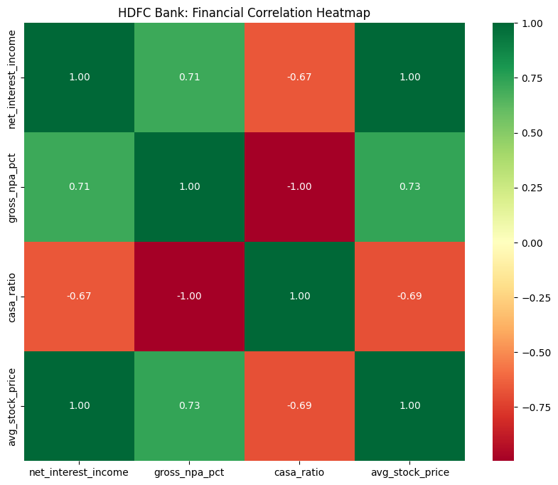
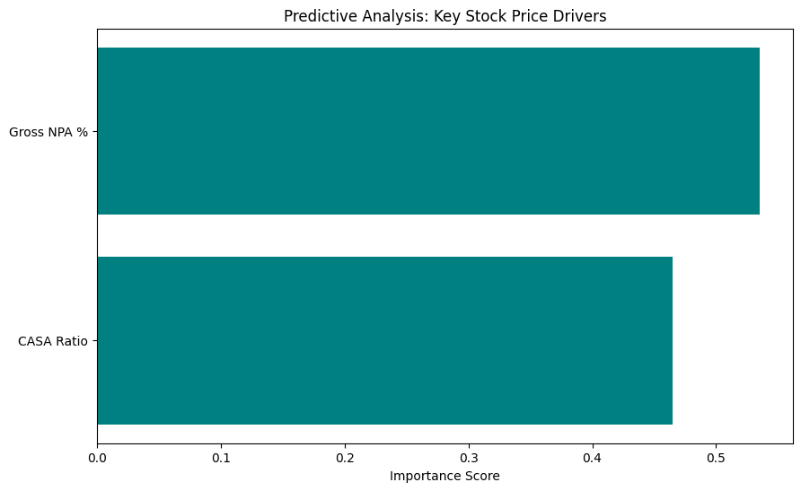

# HDFC Bank: Equity & Asset Quality Analysis

An end-to-end data analytics project exploring the relationship between HDFC Bank's internal financial metrics (NPA, CASA) and its market valuation.

## The Data Pipeline
1. **SQL**: Cleaned and joined quarterly banking metrics with historical stock price data.
2. **Python**: Performed statistical correlation, data visualization, and predictive modeling (Random Forest).
3. **Tableau**: Developed an executive dashboard for stakeholder reporting.

## Key Insights
* **Inverse Correlation**: Visualized a clear relationship between Gross NPA% and market stock price.
* **Profit Drivers**: Used Random Forest Feature Importance to identify that the **CASA Ratio** is a primary driver of stock valuation stability.
* **Market Benchmarking**: Compared HDFC’s market share against competitors (SBI, ICICI, Axis).

## Tech Stack
* **Languages**: Python (Pandas, Seaborn, Scikit-learn), SQL
* **Tools**: Tableau, MySQL, PyCharm
* **Concepts**: Data Imputation, Predictive Modeling, Correlation Analysis

## Visualizations

## 🔗 Interactive Dashboard
[https://public.tableau.com/views/HDFCBankPerformanceMarketAnalysis/Dashboard1?:language=en-GB&publish=yes&:sid=&:redirect=auth&:display_count=n&:origin=viz_share_link]
